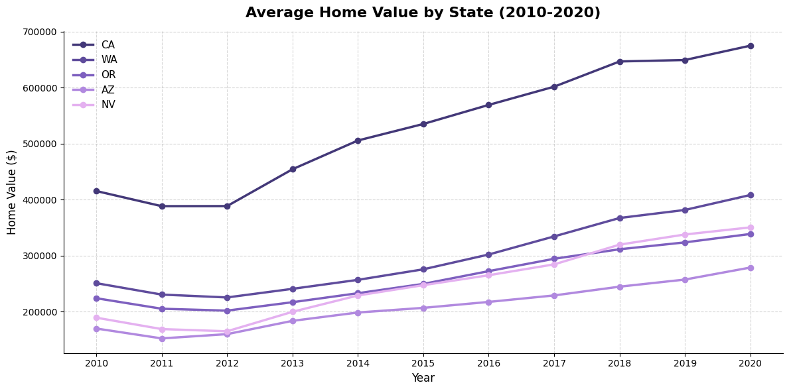
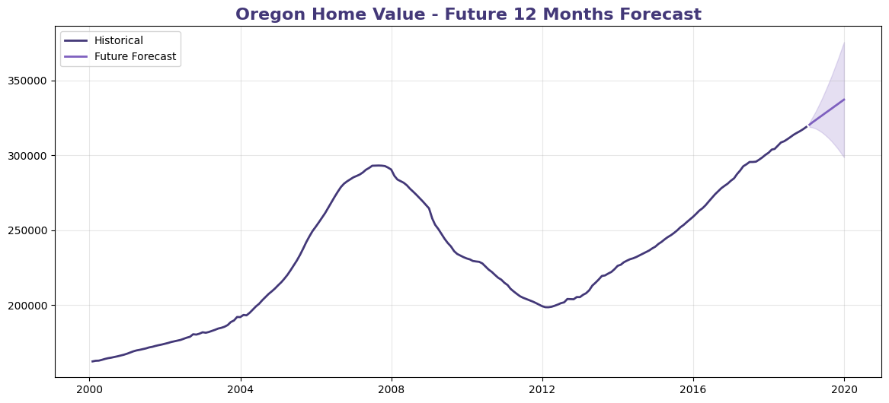
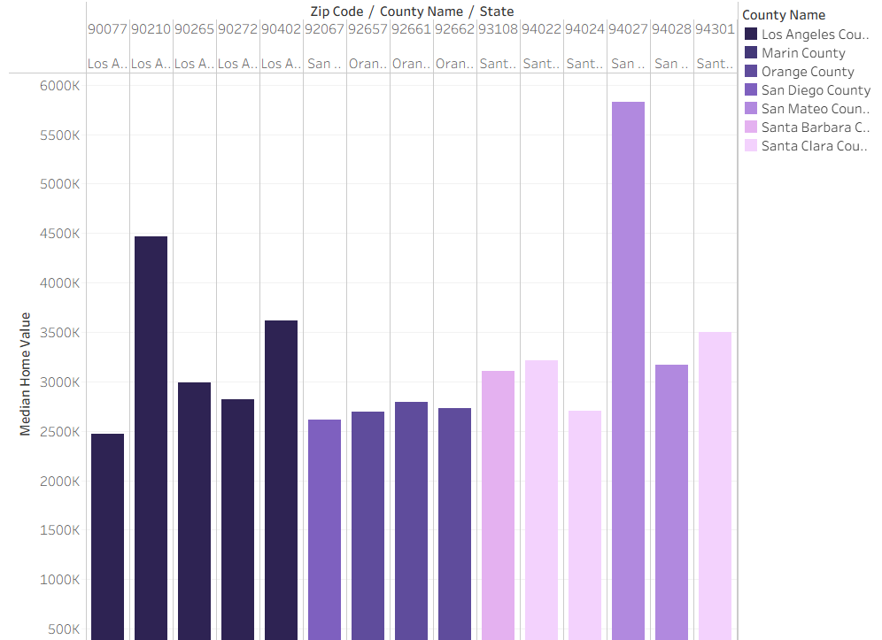

# 🏠 Comprehensive Zillow Housing Market Analysis & Predictive Forecasting

A comprehensive data science project focused on **time series analysis, forecasting, and interactive spatial visualization** of Zillow U.S. housing market data.

---

# 📁 Repository Structure

```text
├── Data/
│   └── data-for-tableau.csv
├── Time_Series_Analysis.ipynb
└── README.md
```

---

# 📊 Phase 1 — Data Preparation & Exploratory Analysis

## Data Preparation

- Loaded the original Zillow dataset.
- Converted the wide-format dataset into a long-format time series.
- Renamed:
  - Date column → **Date**
  - Value column → **Home Value**
- Converted Date to **Datetime**.
- Set Date as the DataFrame index.

---

## Data Filtering

Filtered the dataset to include only:

- California (CA)
- Washington (WA)
- Oregon (OR)
- Arizona (AZ)
- Nevada (NV)

Time period:

- 2010 → 2020

---

## Data Processing

- Grouped Home Values by State.
- Resampled to **Yearly Mean**.
- Saved processed dataset as:

```text
Data/data-for-tableau.csv
```

---

## Historical Trend

### Objective

Visualize historical housing prices across the five selected states.

### Result

- California maintained the highest home values.
- Washington and Oregon showed continuous growth.
- Arizona and Nevada recovered steadily after earlier declines.



---

# 🔮 Phase 2 — Time Series Forecasting (Oregon)

## Data Selection

- State: Oregon (OR)
- Monthly Mean Home Values
- Period:
  - January 2000
  - December 2018

---

## Exploratory Analysis

### Time Series Decomposition

- Trend detected ✔
- Very weak seasonality
- Random residual component

---

### Stationarity Test

Used:

- Augmented Dickey-Fuller (ADF)

Result:

- p-value = **0.3874**
- Series is **Non-Stationary**

Solution:

- Second-order Differencing (d=2)

---

## Model Building

Three forecasting models were evaluated.

| Model | Parameters | AIC |
|-------|------------|------|
| Manual ARIMA | ARIMA(1,2,1) | 3457.674 |
| Manual SARIMA | (1,2,1)(1,0,1)12 | 3393.397 |
| Auto ARIMA | ARIMA(0,2,0) | **3453.299** |

---

## Model Evaluation

Compared using:

- AIC
- Residual Diagnostics
- Forecast Accuracy

Final Selected Model:

✅ **Auto ARIMA**

Reason:

- Simpler model.
- Better diagnostics.
- Stable forecasting performance.

---

## Forecast

Forecast Horizon:

- 12 Months

Result:

- Final predicted Home Value:
  - **$337,253.12**

Growth:

- **+5.71%**



---

# 🎨 Phase 3 — Tableau Story

Interactive Tableau Story consisting of **4 Story Points**.

---

## Story Point 1

### Median Home Value by Location

Visualization:

- Vertical Bar Chart

Features:

- Top 20 Zip Codes
- Colored by County

Purpose:

- Identify the most expensive housing markets.

---

## Story Point 2

### Home Value Growth

Visualization:

- Line Chart

Features:

- Colored by State
- Percentage increase from 2010

Finding:

✅ Washington recorded the highest increase (~95%).

---

## Story Point 3

### Highlight Table

Includes:

- State
- County
- City
- Zip Code
- Median Home Value

Interactive Filter:

- Month / Year Slider

---

## Story Point 4

### Choropleth Map

Visualization:

- Zip Code Heat Map

Features:

- Dark Background
- Colored by Median Home Value
- Tooltip:
  - County
  - City

Purpose:

- Explore housing prices geographically.

---



---

# 🛠️ Technologies Used

- Python
- Pandas
- NumPy
- Matplotlib
- Statsmodels
- pmdarima
- Tableau Public
- Google Colab

---

# 🔗 Project Links

### 📒 Google Colab

https://colab.research.google.com/drive/1dxhque2BMbxwgR9mIjvvCtP9VpNEIBkM?usp=sharing

---

### 📊 Tableau Story

https://public.tableau.com/app/profile/doha.al.nabahin/viz/ZillowHousingMarketAnalysisStory/ZillowHousingMarketAnalysisStory?publish=yes
